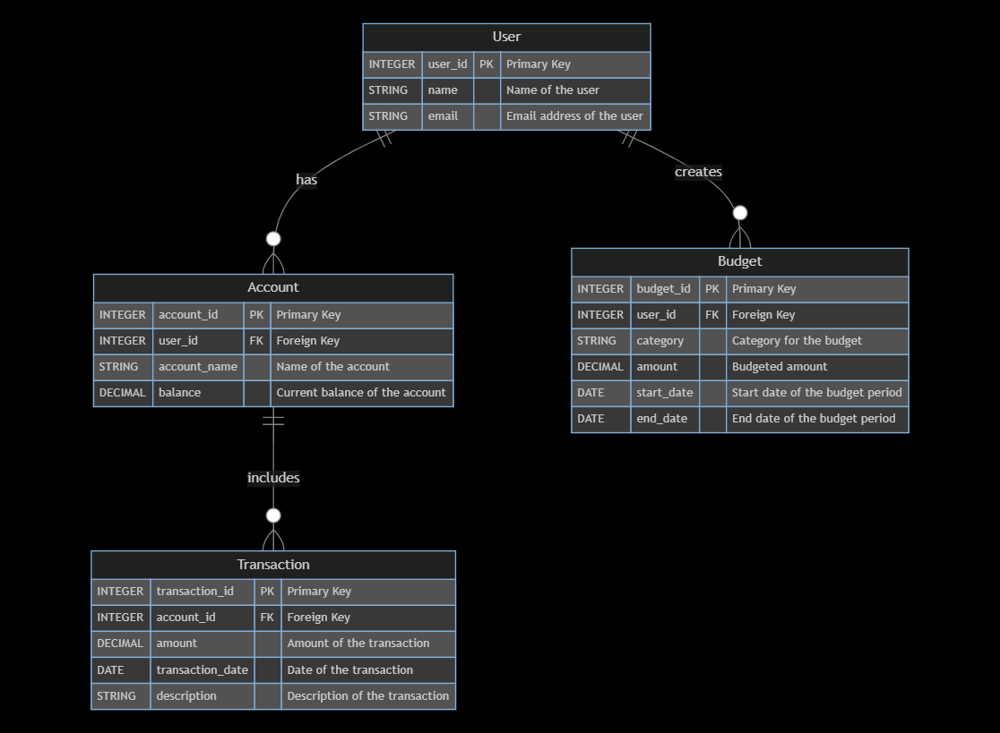

# Personal Finance Management System

By Sahand Soleimani

Video overview: https://link.sahandsoleimani.ir/project.cs50sql

## Scope

Purpose:

* The purpose of this database is to manage personal finances. It helps users track their income, expenses, budgets, and account balances. This allows users to see where their money is going and helps in planning their finances better.

In-Scope:

Users: Individuals who want to manage their personal finances.
Accounts: Different bank accounts and cash reserves.
Transactions: Records of income and expenses.
Budgets: Financial goals and spending limits.

Out-of-Scope:

Investment tracking or trading.
Loan management or credit score tracking.
Detailed tax management.

## Functional Requirements

Users should be able to:

Add and manage bank accounts and cash reserves.
Record income and expenses with relevant details.
Set and manage budgets for different categories.
View reports on income, expenses, and budget adherence.

Beyond Scope:

Automated synchronization with real bank accounts.
Advanced financial analysis and forecasting tools.

## Representation

### Entities

1. User

Attributes:
user_id (Primary Key): Unique identifier for the user.
name: Name of the user.
email: Email address of the user (unique).

2. Account

Attributes:
account_id (Primary Key): Unique identifier for the account.
user_id (Foreign Key): References the user who owns the account.
account_name: Name of the account (e.g., Checking, Savings).
balance: Current balance of the account.

3. Transaction

Attributes:
transaction_id (Primary Key): Unique identifier for the transaction.
account_id (Foreign Key): References the account associated with the transaction.
amount: The amount of the transaction (positive for income, negative for expenses).
transaction_date: Date when the transaction occurred.
description: Description of the transaction.

4. Budget

Attributes:
budget_id (Primary Key): Unique identifier for the budget.
user_id (Foreign Key): References the user who created the budget.
category: Category for which the budget is set (e.g., Food, Entertainment).
amount: Budgeted amount for the category.
start_date: Start date of the budget period.
end_date: End date of the budget period.

Why these attributes and types?

Primary Keys: Unique identifiers for entities to ensure data integrity.
Foreign Keys: Establish relationships between entities.
Data Types: Chosen based on the nature of the data (e.g., DATE for dates, DECIMAL for amounts).

### Relationships

Entity Relationship Diagram:

User has many Accounts (1-to-Many).
Account has many Transactions (1-to-Many).
User has many Budgets (1-to-Many).

## Optimizations

Indexes:

Indexes on user_id in the Account and Budget tables for faster lookups.
Index on account_id in the Transaction table to speed up queries involving transactions.

Views:

A view to show total income, total expenses, and current balance for each user.

## Limitations

Limitations:

The system does not include multi-currency support.
It does not integrate with external financial systems or APIs for automatic updates.

Representation Constraints:

The database may not handle complex financial scenarios like investment portfolios or detailed tax implications.
